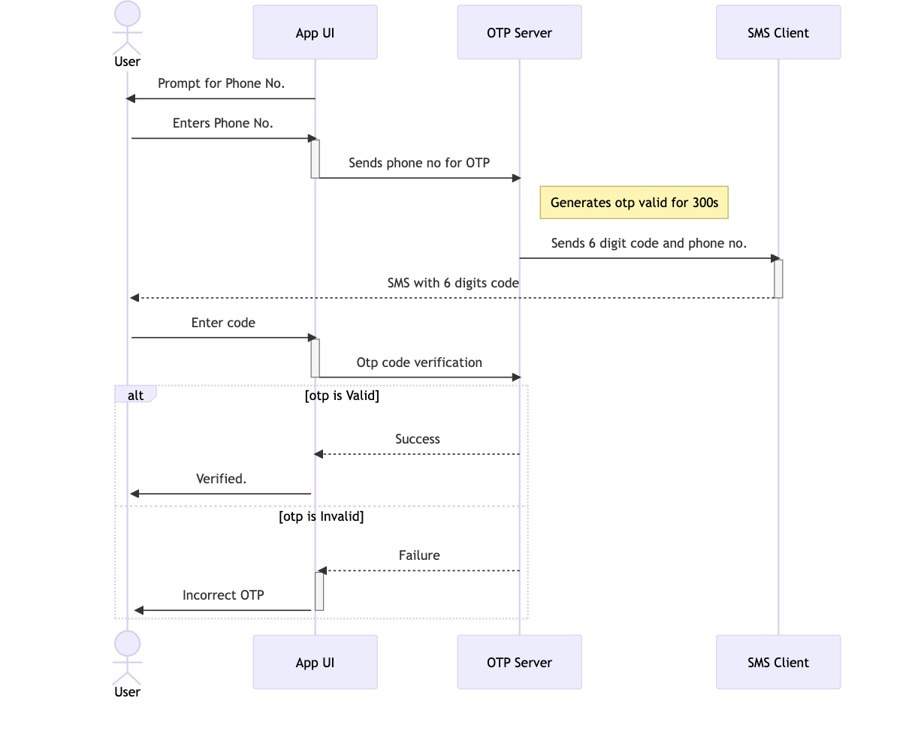

# One-Time Password (OTP) Generator and Verifier

This project demonstrates the generation and verification of One-Time Passwords (OTPs) using an RSA key pair and HMAC-SHA1 hashing. OTPs are commonly used for secure authentication and verification purposes.



## Installation

To run this project, make sure you have the following prerequisites installed:

- Python (version 3.6 or higher)
- `pip` package manager

Then, follow these steps:

1. Clone the repository:

   ```shell
   git clone https://github.com/CosBett/Python-OTP_Generator.git

2. Change to the project directory:

    ```shell
    cd otp-generator
 

3. Install the required dependencies:

   ```shell
    pip install -r requirements.txt

## Usage 

1. Set the secret key:

    In the code, locate the secret variable and assign it a byte string representing your secret key. For example:


     ```shell
    python otp_generator.py
2. The script will display an OTP (One-Time Password) based on the current time and the secret key. This OTP will be valid for a specific time window.

3. Enter the OTP:

   When prompted, enter the OTP displayed on the screen and press Enter.

4. Verify the OTP:

    The script will verify the OTP by decrypting the user's input and comparing it with the original OTP. If they match, an "OTP is valid" message will be displayed. Otherwise, an "OTP is invalid" message will be shown.

## Contributing
Contributions are welcome! If you have any suggestions, improvements, or bug fixes, feel free to open an issue or submit a pull request on the GitHub repository.

## License
This project is licensed under the MIT License. See the LICENSE file for details.
Feel free to customize and modify the README.md file according to your specific project needs.